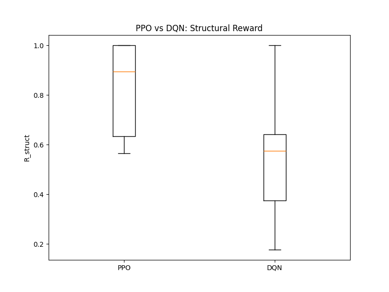
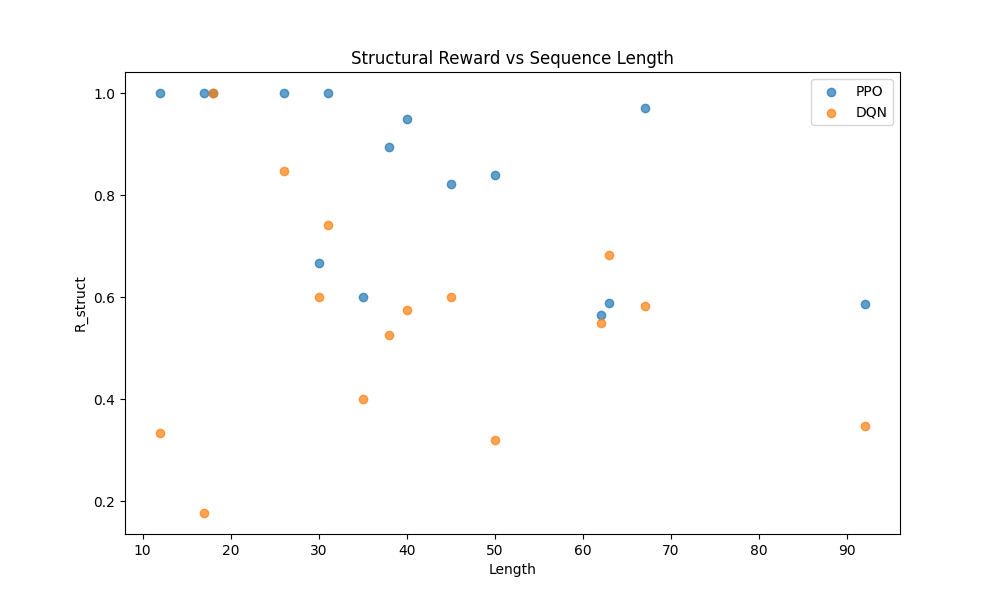

# RNA Inverse Folding — Multi-Objective Deep Reinforcement Learning

Solving the RNA inverse folding problem with PPO and DQN, optimizing for structural accuracy, GC-content, thermodynamic stability, and homopolymer avoidance simultaneously.

[](https://www.python.org/)
[](https://github.com/DLR-RM/stable-baselines3)
[](https://www.tbi.univie.ac.at/RNA/)
[](LICENSE)

## Overview

The RNA inverse folding problem asks: *given a target secondary structure, find a nucleotide sequence that folds into it*. This is an NP-hard combinatorial optimization problem (Bonnet et al., 2020) with a search space of **4ⁿ** candidates.

We formulate this as a **multi-objective reinforcement learning** problem with four simultaneous objectives:

| Objective | Description | Weight |
|-----------|-------------|--------|
| **R_struct** | Structural accuracy (normalized Hamming distance) | α |
| **R_GC** | GC-content fitness — full reward in [40%, 60%] band | β |
| **P_homo** | Homopolymer penalty — penalizes runs > 4 identical bases | γ |
| **R_MFE** | Thermodynamic stability — normalized \|MFE\| per nucleotide | δ |

**Compound reward:** `R = α·R_struct + β·R_GC − γ·P_homo + δ·R_MFE`

## Key Results (Eterna100 Benchmark, 15 Targets)

| Metric | PPO | DQN |
|--------|-----|-----|
| Mean R_struct | **0.769** | 0.568 |
| Success rate | **10.8%** | 7.1% |
| Solved puzzles | **3/15** | 1/15 |

PPO consistently outperforms DQN, with the advantage most pronounced on long sequences (n ≥ 40): mean R_struct of **0.720 vs 0.505**.




## Architecture

```
┌──────────────┐     ┌──────────────────┐     ┌───────────────┐
│  Eterna100   │────▶│  LearnaEnv       │────▶│  PPO / DQN    │
│  Benchmark   │     │  (Gymnasium)     │     │  (SB3)        │
│  (15 targets)│     │                  │     │               │
└──────────────┘     │  • One-hot obs   │     │  • [128,128]  │
                     │  • Partner-aware │     │  • ent=0.02   │
                     │  • Reward shaping│     │  • GAE / Replay│
                     └────────┬─────────┘     └───────┬───────┘
                              │                       │
                     ┌────────▼─────────┐     ┌───────▼───────┐
                     │  ViennaRNA       │     │  TensorBoard  │
                     │  MFE Folding     │     │  Logging      │
                     └──────────────────┘     └───────────────┘
```

### Three-Phase Adaptive Weight Scheduling

| Phase | Steps | Strategy |
|-------|-------|----------|
| **A** (0–30%) | Structure-dominant | α=1.0, β=0.7·β*, γ=γ*, δ=0 |
| **B** (30–70%) | Linear ramp | Smooth transition to target weights |
| **C** (70–100%) | Joint optimization | All weights at target values |

> **Critical insight:** Phase A must include non-zero β and γ from step 0 to prevent GC-content collapse.

## Project Structure

```
RL-Project/
├── environment.py              # Gymnasium RL environment (Partner-Aware obs, 4-objective reward)
├── eterna100.py                # Eterna100 dataset (15 target structures)
├── train_multi_target.py       # Main training pipeline (curriculum, weight scheduling)
├── scripts/
│   ├── analyze_ppo_vs_dqn.py   # PPO vs DQN comparison from TensorBoard logs
│   ├── analyze_dqn.py          # DQN-specific result analysis
│   ├── combine_seeds.py        # Combine multi-seed evaluation results
│   ├── evaluate_deterministic.py  # Deterministic evaluation (ε=0)
│   ├── preflight_check.py      # Environment verification (ViennaRNA, GPU, etc.)
│   └── repair_sequences.py     # Post-hoc sequence repair utilities
├── results/                    # Evaluation CSVs (per-seed, combined, repaired)
├── logs/                       # Training logs (PPO/DQN retrain logs)
├── docs/                       # Figures, reports
├── paper/                      # Manuscript files (intro, bibliography)
├── models/                     # Trained model checkpoints (gitignored)
├── tensorboard_logs/           # TensorBoard logs (gitignored)
├── run_grid_search_ppo.sh      # Grid search — 3 weight configs × PPO
├── run_grid_search_dqn.sh      # Grid search — 3 weight configs × DQN
├── run_multiseed.sh            # Multi-seed training runner
├── environment.yml             # Conda environment definition
├── requirements.txt            # pip dependencies
├── LICENSE
└── README.md
```

## Quick Start

### Prerequisites

- Python 3.10+
- Conda (for ViennaRNA installation)

### Installation

> **Platform note — ViennaRNA is Linux/macOS only.** The bioconda channel does not publish `viennarna` for `win-64`, so `conda env create` will fail on native Windows. **Windows users must use WSL2** (instructions below).

#### Linux / macOS

```bash
git clone https://github.com/atakmty/RL-Project.git
cd RL-Project
conda env create -f environment.yml
conda activate rlrna
```

#### Windows (via WSL2)

**1. Install WSL2 + Ubuntu** (administrator PowerShell):

```powershell
wsl --install -d Ubuntu
```

**2. Open Ubuntu** and install Miniconda:

```bash
wget https://repo.anaconda.com/miniconda/Miniconda3-latest-Linux-x86_64.sh
bash Miniconda3-latest-Linux-x86_64.sh
```

**3. Clone and set up** (same as Linux):

```bash
git clone https://github.com/atakmty/RL-Project.git
cd RL-Project
conda env create -f environment.yml
conda activate rlrna
```

### Training

```bash
# Train PPO on all 15 targets (balanced config)
python train_multi_target.py --algo ppo --seed 42 --weight-config 0

# Train DQN on all 15 targets
python train_multi_target.py --algo dqn --seed 42 --weight-config 0

# Run full grid search (3 weight configs)
bash run_grid_search_ppo.sh
bash run_grid_search_dqn.sh
```

### Weight Configurations

| Config | α | β | γ | δ | Strategy |
|--------|---|---|---|---|----------|
| 0 | 0.5 | 0.2 | 0.1 | 0.2 | Balanced |
| 1 | 0.6 | 0.15 | 0.1 | 0.15 | Structure-heavy |
| 2 | 0.4 | 0.2 | 0.15 | 0.25 | Thermodynamic-focused |

### Evaluation

```bash
# Deterministic evaluation (epsilon=0)
python scripts/evaluate_deterministic.py

# Compare PPO vs DQN
python scripts/analyze_ppo_vs_dqn.py
```

### TensorBoard

```bash
tensorboard --logdir ./tensorboard_logs/
```

## Technical Details

### Observation Space (7n + 10 dimensions)

**Base encoding (7n + 1):**

| Component | Dims | Description |
|-----------|------|-------------|
| Sequence one-hot | 4n | A/C/G/U at each placed position |
| Target one-hot | 3n | ./(/) at each position |
| Progress | 1 | current_step / n |

**Partner-Aware extension (+9):**

| Component | Dims | Description |
|-----------|------|-------------|
| Local target char | 3 | One-hot of target at current step |
| is_paired | 1 | 1.0 if position has a base-pair partner |
| partner_placed | 1 | 1.0 if partner nucleotide already placed |
| partner_nucleotide | 4 | One-hot of partner's nucleotide |

### Action Space

**Discrete(4)** — at each step, the agent selects one nucleotide (A/C/G/U).

### Reward Shaping (Ng et al., 1999)

```
Φ(s) = correct_pairs / checked_pairs
F(s, a, s') = 0.1 × (0.99 × Φ(s') − Φ(s))
```

### Algorithm Comparison

| Feature | PPO | DQN |
|---------|-----|-----|
| Policy type | On-policy | Off-policy |
| Credit assignment | Multi-step (GAE) | 1-step TD bootstrap |
| Long-horizon (n>30) | Strong | Weak |
| Exploration | Entropy bonus | ε-greedy (1.0 → 0.08) |

## References

- Bonnet, É., Rzążewski, P., & Sikora, F. (2020). *Designing RNA secondary structures is hard*. J. Comput. Biol.
- Runge, F., Stoll, D., Falkner, S., & Hutter, F. (2019). *Learning to Design RNA*. ICLR.
- Ng, A. Y., Harada, D., & Russell, S. (1999). *Policy invariance under reward transformations*. ICML.
- Lorenz, R., et al. (2011). *ViennaRNA Package 2.0*. Algorithms for Molecular Biology.
- Anderson-Lee, J., et al. (2016). *Principles for predicting RNA secondary structure design difficulty*. J. Mol. Biol.

## Authors

- **Ata Kamutay** — Department of Health Informatics
- **Utku Bora Döke** — Department of Health Informatics

## License

This project is licensed under the MIT License — see [LICENSE](LICENSE) for details.
